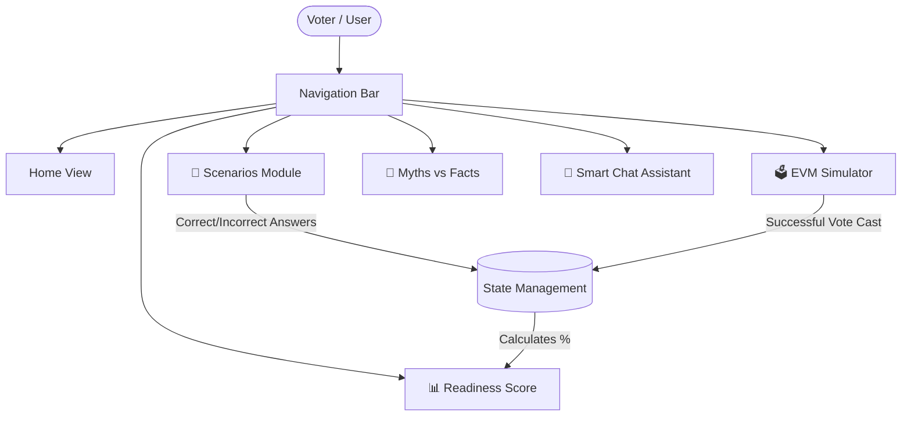
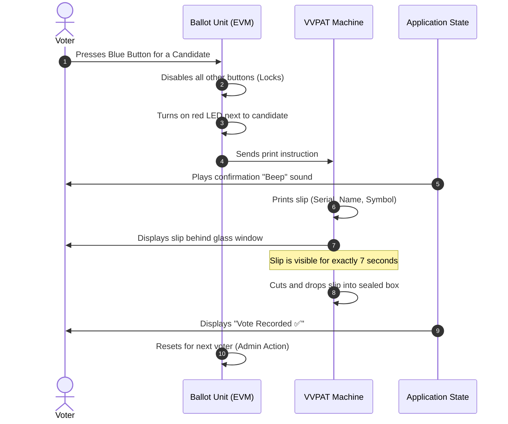

# 🇮🇳 VoterReady Simulator

**Vertical:** Civic Tech / Digital Literacy  
**Live Application:** [https://voterready-india-508946405122.us-central1.run.app](https://voterready-india-508946405122.us-central1.run.app)

**VoterReady Simulator** is an interactive, educational web application designed to help citizens understand the electoral process in India, specifically the voting mechanisms and polling day scenarios. Through a hands-on approach, users can test their knowledge, experience a virtual Electronic Voting Machine (EVM), and calculate their overall "Voter Readiness Score."

---

## 🎯 My Unique Approach

While many voter education platforms rely on static text and FAQs, my approach prioritizes **real-world usability** through a **high-fidelity simulation**. By placing users in practical, high-pressure scenarios (like reaching the booth late or missing names on lists) and letting them interact with a visually and audibly accurate EVM/VVPAT module, the application fosters experiential learning. This ensures users are genuinely prepared for the physical and psychological aspects of Election Day.

---

## 🧠 Logic & Assumptions (The Election Process)

The core logic assumes the standard Election Commission of India (ECI) framework for the general election process:
1. **Identification Verification**: Assumes that simply possessing a Voter ID (EPIC) is insufficient; the voter's name MUST be on the electoral roll (managed by the BLO). This logic is tested in the scenario engine.
2. **Booth Management**: Assumes standard ECI booth timings (e.g., closing at 6:00 PM) and validates the rule that voters in the queue before closing time are guaranteed a vote.
3. **Ballot Submission (EVM/VVPAT State Machine)**: 
   - The user selects a candidate by pressing a button on the Ballot Unit.
   - The state machine immediately locks out all other buttons (preventing double voting).
   - An LED illuminates, a confirmation beep plays, and the VVPAT state machine is triggered.
   - The VVPAT displays a dynamically generated slip containing the candidate's serial number, name, and symbol for precisely **7 seconds** before transitioning the slip to a "dropped" (sealed) state, completing the ballot submission.

---

## ✨ Challenge 2 Improvements

This updated version of the VoterReady Simulator features significant enhancements to align with production-grade standards:

1. **Accessibility (Inclusive Design):**
   - Injected semantic HTML tags and strict `aria-label`, `aria-selected`, and `role="tab"` attributes.
   - Implemented `aria-live="polite"` and `aria-live="assertive"` regions so screen readers dynamically announce real-time feedback (e.g., when a vote is successfully cast or a scenario verdict is revealed).
   - Maintained a high-contrast dark theme to aid visual accessibility.

2. **Security (Strict Validation & Sanitization):**
   - Implemented strict input sanitization on all user-facing forms (specifically the Chat Assistant). 
   - User inputs are aggressively parsed, neutralizing `<` and `>` characters into safe HTML entities (`&lt;` and `&gt;`) to thoroughly prevent Cross-Site Scripting (XSS) and injection attacks while preserving the unique simulation logic.

3. **Testing Suite:**
   - Introduced a lightweight `tests/` directory with an autonomous unit testing suite.
   - Tests automatically validate the successful flow of a voter through the simulation (verifying that EVM state changes correctly and the Readiness Score accumulates properly) and ensure that "invalid" inputs are successfully caught and sanitized.

---

## 🌟 Key Features

1. **🚨 Test Me (Booth Scenarios):** 
   Interactive situations based on Election Commission of India (ECI) guidelines. Users must choose the correct action when faced with common polling day dilemmas.

2. **🗳️ EVM & VVPAT Simulator:** 
   A virtual Electronic Voting Machine that mimics the real-life experience. It features fictional candidates, an LED indicator, a beep sound, and a simulated VVPAT window.

3. **🧠 Myth vs Fact Flashcards:** 
   Busts common misinformation regarding the voting process, EVM security, and voter eligibility through interactive flip cards.

4. **💬 Smart Chat Assistant:** 
   A built-in bot that answers common queries about the voting process, forms, and terminology.

5. **📊 Readiness Score Dashboard:** 
   Calculates a readiness percentage based on the user's performance in the scenarios and EVM simulator, highlighting weak areas and offering actionable tips for improvement.

---

## 📐 Application Architecture & User Flow



---

## ⚙️ EVM & VVPAT Voting Sequence



---

## 🛠️ Technology Stack

- **Frontend:** HTML5, Vanilla JavaScript (ES6 Modules), CSS3 (Custom properties, Flexbox/Grid)
- **Deployment:** Multi-stage Docker build utilizing `alpine` and `nginx:alpine-slim`
- **Infrastructure:** Google Cloud Run
- **Design:** Custom UI with modern glassmorphism, responsive layouts, and interactive micro-animations.

---

## 🚀 How to Run Locally

### Using Docker
1. Ensure Docker is installed on your machine.
2. Build the Docker image:
   ```bash
   docker build -t voterready-simulator .
   ```
3. Run the container:
   ```bash
   docker run -p 8080:8080 voterready-simulator
   ```
4. Open your browser and navigate to `http://localhost:8080`.

### Running Unit Tests
- Tests can be run by serving the application and navigating to `/tests/index.html`.

---

> **Disclaimer:** This simulator is built strictly for educational and awareness purposes. It is not affiliated with the Election Commission of India. Always refer to official ECI guidelines (`voters.eci.gov.in`) for final authority on election procedures.
