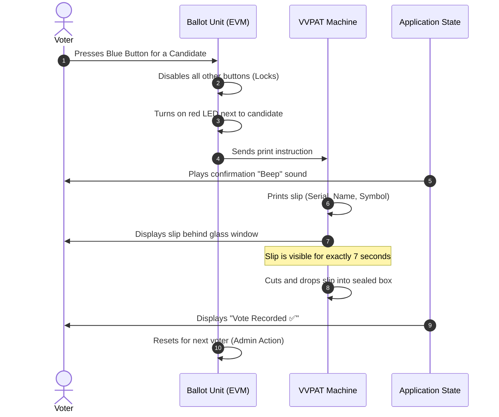

# 🇮🇳 VoterReady Simulator

**VoterReady Simulator** is an interactive, educational web application designed to help citizens understand the electoral process in India, specifically the voting mechanisms and polling day scenarios. Through a hands-on approach, users can test their knowledge, experience a virtual Electronic Voting Machine (EVM), and calculate their overall "Voter Readiness Score."

---

## 🌟 Key Features

1. **🚨 Test Me (Booth Scenarios):** 
   Interactive situations based on Election Commission of India (ECI) guidelines. Users must choose the correct action when faced with common polling day dilemmas (e.g., missing name on the voter list, arriving late).

2. **🗳️ EVM & VVPAT Simulator:** 
   A virtual Electronic Voting Machine that mimics the real-life experience. It features fictional candidates, an LED indicator, a beep sound, and a simulated VVPAT (Voter Verifiable Paper Audit Trail) window that displays the printed slip for 7 seconds before dropping it into a sealed box.

3. **🧠 Myth vs Fact Flashcards:** 
   Busts common misinformation regarding the voting process, EVM security, and voter eligibility through interactive flip cards.

4. **💬 Smart Chat Assistant:** 
   A built-in bot that answers common queries about the voting process, forms (like Form 6 and Form 8), and terminology (e.g., EPIC, NOTA, BLO).

5. **📊 Readiness Score Dashboard:** 
   Calculates a readiness percentage based on the user's performance in the scenarios and EVM simulator, highlighting weak areas and offering actionable tips for improvement.

---

## 📐 Application Architecture & User Flow

The application is structured to provide a seamless navigation experience, tying interactive learning modules into a centralized scoring system.


---

## ⚙️ EVM & VVPAT Voting Sequence

Understanding how the EVM and VVPAT work together is crucial for voter confidence. The sequence below outlines the exact technical process simulated in the application:



---

## 🛠️ Technology Stack

- **Frontend:** HTML5, Vanilla JavaScript, CSS3 (Custom properties, Flexbox/Grid)
- **Deployment:** Docker & Nginx (Configured for containerized deployment)
- **Design:** Custom UI with modern glassmorphism, responsive layouts, and interactive micro-animations.
- **Assets:** Emojis and standard web fonts (Google Fonts - Inter)

---

## 🚀 How to Run Locally

### Using standard Web Server (e.g., VS Code Live Server)
1. Clone this repository.
2. Open `index.html` in your browser.

### Using Docker
1. Ensure Docker is installed on your machine.
2. Build the Docker image:
   ```bash
   docker build -t voterready-simulator .
   ```
3. Run the container:
   ```bash
   docker run -p 8080:80 voterready-simulator
   ```
4. Open your browser and navigate to `http://localhost:8080`.

---

> **Disclaimer:** This simulator is built strictly for educational and awareness purposes. It is not affiliated with the Election Commission of India. Always refer to official ECI guidelines (`voters.eci.gov.in`) for final authority on election procedures.
