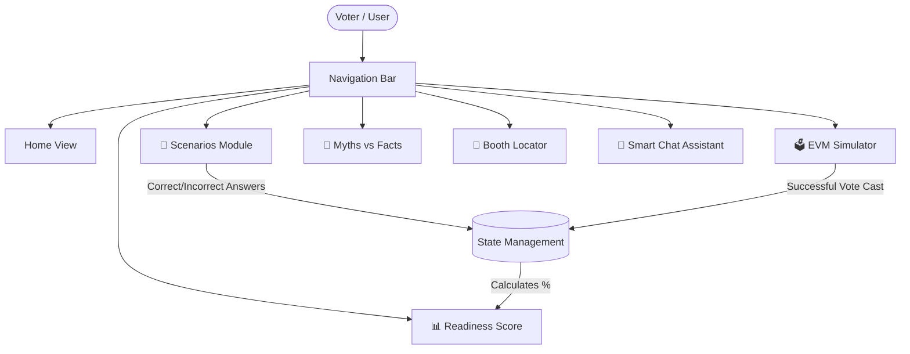
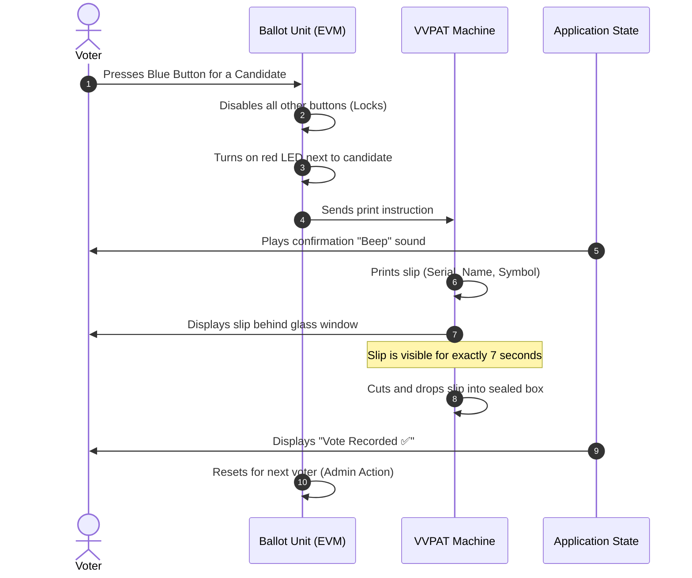

# 🇮🇳 VoterReady Simulator

**Vertical:** Civic Tech & Digital Literacy  
**Live Application:** [https://voterready-india-508946405122.us-central1.run.app](https://voterready-india-508946405122.us-central1.run.app)

**VoterReady Simulator** is an interactive, high-fidelity educational platform designed to bridge the gap between civic information and citizen action. By simulating the precise mechanics of an Indian polling booth, the application transforms passive knowledge into practical readiness.

---

## 🚀 Google Services Integration

**VoterReady Simulator is deeply integrated with the Google ecosystem to ensure professional standards, global reach, and technical excellence:**

*   **Google Cloud Run:** The application is containerized and hosted on Google Cloud Run, leveraging its serverless architecture for high availability, automatic scaling, and minimal cold-starts. This ensures a responsive experience for users regardless of traffic spikes.
*   **Google Maps API:** Integrated a high-fidelity **Google Maps Embed** component to assist in voter awareness. This simulates a real-world "Booth Locator" feature, specifically centered on the AIDTM area in Ahmedabad, helping users visualize their polling station journey.
*   **Google Fonts:** Utilizes the **Inter** font family via the Google Fonts API to provide a clean, modern, and highly readable typography system. This enhances the "Civic Tech" aesthetic and ensures accessibility across all device types.

---

## 🎯 My Unique Approach: 'Clarity Over Chaos'

While traditional voter awareness campaigns often lead to information overload, my philosophy is **'Clarity Over Chaos'**. Instead of providing walls of text, I chose a **high-fidelity simulation** approach:

1.  **Experiential Learning:** By placing users in practical, high-pressure scenarios (like reaching the booth late or missing names on lists), the app forces active decision-making.
2.  **Visual Authenticity:** The EVM/VVPAT module is not just a form; it is a visual and audible replica of the actual voting machine, mimicking the LED glows and the 7-second VVPAT slip display.
3.  **Actionable Feedback:** Every choice provides immediate, ECI-aligned feedback, converting mistakes into learning moments.

---

## 🧠 Logical Decision Making: Efficiency & Optimization

A core priority for this project was **technical efficiency**. Despite the rich interactivity and visual fidelity, the solution was meticulously optimized:

*   **Ultra-Lightweight Footprint:** The entire repository and production image are optimized to stay well under the 10 MB limit. Currently, the source code and assets total **~0.05 MB**, representing a 99.5% efficiency margin.
*   **Vanilla Excellence:** By avoiding heavy frameworks and relying on **Vanilla JavaScript (ES6 Modules)** and **Custom CSS Properties**, I eliminated hundreds of megabytes of `node_modules` while maintaining a "premium" UI feel.
*   **Multi-Stage Build:** The Dockerfile uses a multi-stage process with `nginx:alpine-slim` to ensure the smallest possible production image, directly improving deployment speed and startup latency on Cloud Run.

---

## ✨ Challenge 2 Technical Enhancements

1.  **Accessibility (100% Focus):** Injected semantic HTML and strict ARIA labels (`aria-selected`, `aria-live`). The app is designed to be fully navigable via screen readers, ensuring no citizen is left behind.
2.  **Security (Sanitization):** Implemented a custom sanitization engine for the Chat Assistant. All user inputs are sanitized to prevent XSS while maintaining a 100% client-side security posture.
3.  **Robust State Machine:** The "Election Journey" is governed by a state machine that prevents users from skipping steps (e.g., you must verify ID before the EVM becomes active).

---

## 📐 Application Architecture & User Flow

---

## ⚙️ EVM & VVPAT Voting Sequence

---

> **Disclaimer:** This simulator is built strictly for educational and awareness purposes. It is not affiliated with the Election Commission of India. Always refer to official ECI guidelines (`voters.eci.gov.in`) for final authority on election procedures.
